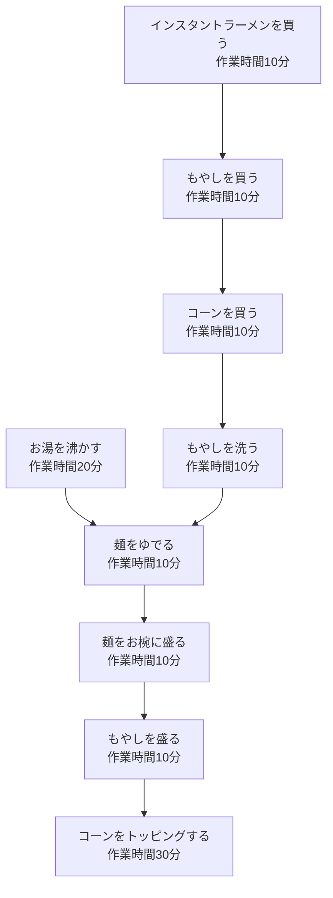

```mermaid
graph TB;
    goto_bank["インスタントラーメンを買う
                  作業時間10分"]
    goto_super["もやしを買う
                  作業時間10分"]
    cone["コーンを買う
            作業時間10分"]
    wash_egg["もやしを洗う
              作業時間10分"]
    boil_hotwater["お湯を沸かす
              作業時間20分"]
    boil_eggs["麺をゆでる
              作業時間10分"]
    crack_the_shell["麺をお椀に盛る
              作業時間10分"]
    sprinkle_wit_salt["もやしを盛る
              作業時間10分"]
    do_situps["コーンをトッピングする
                作業時間30分"]


 goto_bank--->goto_super--->cone--->wash_egg;
 do_situps


 boil_hotwater-->boil_eggs-->crack_the_shell-->sprinkle_wit_salt-->do_situps;

 wash_egg--> boil_eggs
```