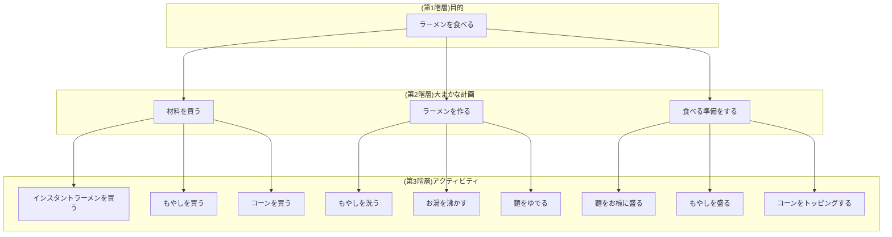

```mermaid
flowchart TB
subgraph "(第1階層)目的"
    id1["ラーメンを食べる"]
end

subgraph "(第2階層)大まかな計画"
    id2["材料を買う"]
    id3["ラーメンを作る"]
    id4["食べる準備をする"]
end

subgraph "(第3階層)アクティビティ"
    id5["インスタントラーメンを買う"]
    id6["もやしを買う"]
    id13["コーンを買う"]
    id7["もやしを洗う"];
    id8["お湯を沸かす"]
    id9["麺をゆでる"]
    id10["麵をお椀に盛る"]
    id11["もやしを盛る"]
    id12["コーンをトッピングする"]
end

id1--->id2;
id1--->id3;
id1--->id4;

id2--->id5;
id2--->id6;
id2--->id13;
id3--->id7;
id3--->id8;
id3--->id9;
id4--->id10;
id4--->id11;
id4--->id12;
```